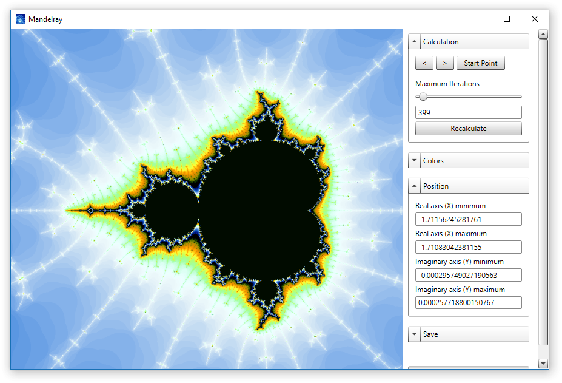

# Mandelray: A Mandelbrot Set Viewer in C#

Mandelray calculates the [Mandelbrot set](https://en.wikipedia.org/wiki/Mandelbrot_set) and allows to navigate and zoom in it.

Calculations are performed in C# and WPF is used to display the user interface.
The algorithm is based on the [escape time algorithm](https://en.wikipedia.org/wiki/Mandelbrot_set#Escape_time_algorithm) with [continuous (smooth) coloring](https://en.wikipedia.org/wiki/Mandelbrot_set#Continuous_(smooth)_coloring).

## Features

- Fast multi-threaded calculation
- Instant preview after zooming
- Different color schemes
- Navigation history
- Save the result as an image

## Usage

Click and drag with the left mouse button pressed to zoom within the Mandelbrot set.
You can zoom even if a calculation is in progress (the current calculation will be cancelled).
Use the arrow buttons in the upper right corner to navigate in your zoom history.
You can always go back to the beginning with the Start Point button.
You can change the active color scheme at any time.

## Requirements

- [.NET Framework 4.5](https://docs.microsoft.com/en-us/dotnet/framework/install/on-windows-10) (on Windows)

## Credits

### SimpleStyles: Custom WPF Controls

Mandelray uses the [SimpleStyles](https://web.archive.org/web/20060425060519/http://notstatic.com/simplestyles) custom WPF Controls by Robert Ingebretsen.
These styles were originally published to MSDN some years ago.
Unfortunately, there is only [this archived download link](https://web.archive.org/web/20060425060519/http://notstatic.com/uploads/simplestyles/FebCTPSimpleStyles.zip) available at the moment.